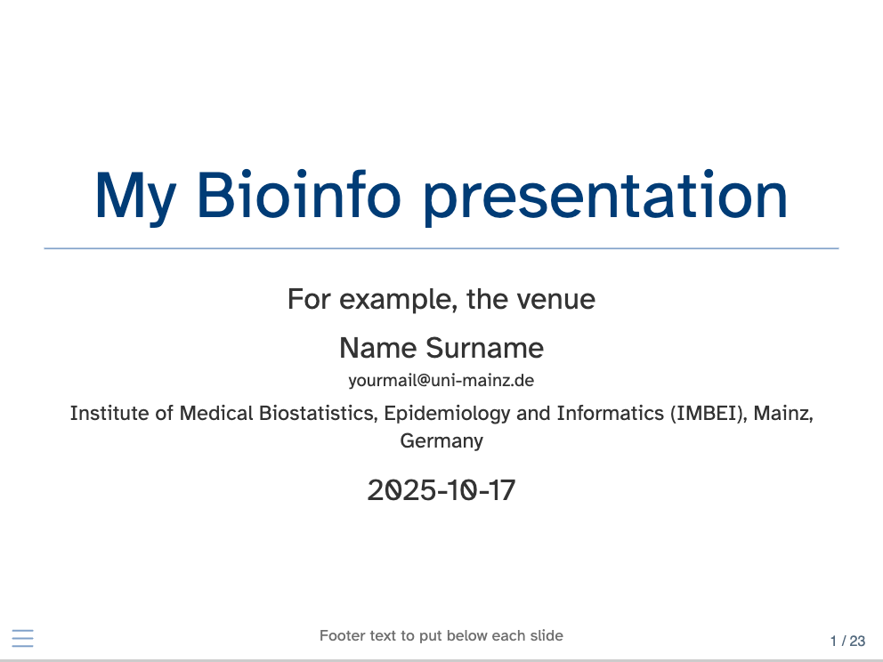

```{r, include = FALSE}
knitr::opts_chunk$set(
  collapse = TRUE,
  comment = "#>"
)
```

# IMBEIstyle

```{r setup}
library("IMBEIstyle")
```

The goal of IMBEIstyle is to provide a simple way to create an analysis report, styled
up with some fancy options and some UM corporate design colors, and a revealjs quarto
presentation, in a similar fashion.

More content could cover the need of e.g. a poster template - especially if doable 
within the quarto framework.

## Installation

You can install the development version of IMBEIstyle like so:

```{r install, eval=FALSE}
library("remotes")
remotes::install_github("imbeimainz/IMBEIstyle")
```

# Using IMBEIstyle in your documents

Here is how you can create the reports and presentations with this package.

## An IMBEIstyle report

```{r examplereport}
IMBEIstyle::create_bioinfo_html(file_name = "myfirstreport",
                                report_folder = tempdir())
```

Once the source document has been opened (e.g. within the RStudio IDE), you can
compile it to see that everything works as expected.

The next obvious steps are oriented towards filling in its contents. 
For this, you can refer to the creation of any Quarto based document - the Quarto 
tutorial (https://quarto.org/docs/get-started/hello/rstudio.html) is an excellent
place to start.

Once rendered, this is how your report document could look like:

<iframe src="bioinfo-html-report-template.html" width=800 height=300></iframe>

## An IMBEIstyle presentation

Similarly, to create a Quarto-based presentation, you can use

```{r examplepresentation}
IMBEIstyle::create_bioinfo_revealjs(file_name = "myfirstpresentation",
                                    presentation_folder = tempdir())
```

... which again could look like this (this is a static snapshot):

<!-- <iframe src="./bioinfo-revealjs-presentation-template.html" width=800 height=300></iframe> -->

{width=70%}

# How to further customize the looks of these documents

Some obvious spots to touch on would be

- an alternative font
- alternative sets of colors
- alternative or multiple output types

You can control these and more aspects from the yaml of the respective documents, and/or changing directly the associated `.scss` style files.

# Changes in the versions of the provided template documents

So far, this is the first iterations on these documents. 

In case newer versions are deployed, some notable changes can be reported in the content of this section.

# Session info {-}

```{r sessioninfo}
sessionInfo()
```

